# Authentication Flow and Developer Guide

## 1. Purpose and audience

This document explains the implemented Authentication system in Memory Map for backend and Flutter developers.

It is intended for:

- developers who need to trace Google login, session restore, refresh token rotation, automatic access token refresh, logout, and protected backend requests;
- reviewers who need to verify security boundaries and transaction boundaries;
- future contributors who need to add protected endpoints without changing the authentication architecture by accident.

This guide describes the current codebase. It does not define new product behavior and does not replace the source code. When a detail matters, use the linked source files as the final implementation reference.

## 2. Executive summary

Memory Map uses Google Sign-In on the mobile client only to obtain a Google ID Token. The backend verifies that Google ID Token, maps the Google subject to an internal `User`, and returns:

- a short-lived JWT Access Token;
- a raw Refresh Token;
- a public user payload without `googleSubject`.

The backend stores only a SHA-256 hash of each Refresh Token in PostgreSQL. Raw Refresh Tokens are returned to the client once and are kept by Flutter inside `flutter_secure_storage`.

Access Tokens are stateless JWTs signed by the backend with HS256. Their `sub` claim is the internal User UUID, not the Google subject and not an email address.

Refresh Tokens are stateful. They are stored in `refresh_tokens`, have an expiry time, can be revoked, and are rotated on every `/api/v1/auth/refresh` call. Rotation is protected by a conditional revoke:

```sql
UPDATE refresh_tokens
SET revoked_at = :revokedAt
WHERE id = :id
  AND revoked_at IS NULL
```

This makes replay of an already-used active Refresh Token fail once another request has revoked it first.

Flutter has two separate refresh paths:

- startup Session Restore: reads the stored session, calls `/api/v1/auth/refresh`, persists rotated tokens, and updates in-memory session state;
- automatic Access Token refresh: an authorized Dio interceptor reacts to a `401` from a protected request, performs a single-flight refresh, retries replayable requests once, and invalidates the session if the retried request still gets `401`.

Logout is local-first on Flutter: secure storage is cleared before the remote logout call. Backend logout is idempotent and best-effort from the mobile perspective.

## 3. System context

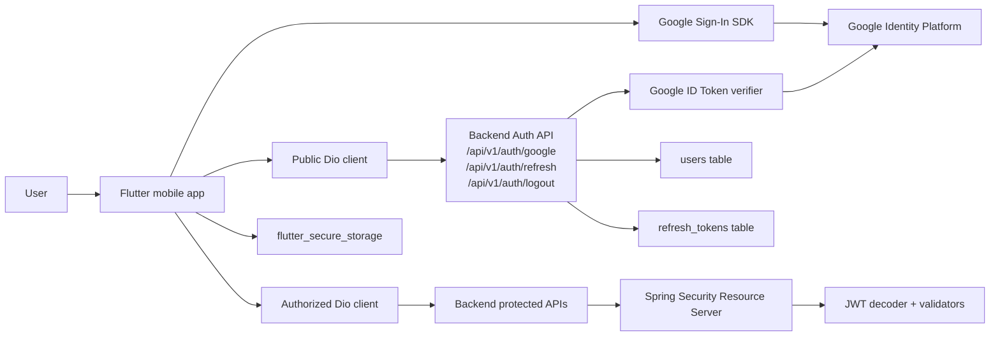

Primary implementation links:

- Backend API: [AuthController.java](../backend/src/main/java/memory_map/backend/auth/api/AuthController.java)
- Backend security: [SecurityConfiguration.java](../backend/src/main/java/memory_map/backend/auth/security/SecurityConfiguration.java)
- Backend login orchestration: [DefaultGoogleLoginService.java](../backend/src/main/java/memory_map/backend/auth/login/DefaultGoogleLoginService.java)
- Backend refresh rotation: [TransactionalRefreshTokenRotationService.java](../backend/src/main/java/memory_map/backend/auth/refresh/TransactionalRefreshTokenRotationService.java)
- Flutter repository orchestration: [default_auth_repository.dart](../mobile/lib/features/auth/application/default_auth_repository.dart)
- Flutter router: [router.dart](../mobile/lib/app/router.dart)
- Flutter authorized interceptor: [authorized_auth_interceptor.dart](../mobile/lib/features/auth/data/network/authorized_auth_interceptor.dart)

## 4. Core security model

### Credentials and storage

| Credential | Issuer | Consumer | Transport | Persistence | Logging rule |
| --- | --- | --- | --- | --- | --- |
| Google ID Token | Google SDK / Google Identity Platform | Backend Google verifier | Flutter sends it to `POST /api/v1/auth/google` as `idToken` | Not persisted by Flutter or backend | Never log raw value |
| Access Token | Backend JWT issuer | Flutter authorized Dio, Spring Security Resource Server | `Authorization: Bearer <ACCESS_TOKEN>` on protected requests | Stored in Flutter secure session JSON; not stored in backend DB | Never log raw value |
| Refresh Token, raw | Backend refresh token issuer | Flutter Session Restore, automatic refresh, logout | JSON field `refreshToken` on `/refresh` and `/logout` | Stored in Flutter secure session JSON; never stored raw in backend DB | Never log raw value |
| Refresh Token hash | Backend hasher | Backend refresh repository | Internal only | Stored in `refresh_tokens.token_hash` | Treat as sensitive; do not expose through API |
| Google subject | Google ID Token payload `sub` | Backend user lookup | Internal backend flow | Stored in `users.google_subject` | Do not expose to mobile API responses |
| Internal User UUID | Backend application | Backend JWT subject and API response user id | JWT `sub`, JSON `user.id` | Stored as `users.id` | Safe identifier, but still avoid unnecessary logs |

### Security invariants

- Google ID Token verification happens on the backend, not only on the client.
- The backend stores the Google subject but returns the internal User UUID to the client.
- Access Token subject is the internal User UUID.
- Refresh Token raw values are never persisted in PostgreSQL.
- Refresh Token rotation revokes the current token conditionally before saving the new persisted token inside the rotation transaction.
- Auth endpoints are public; all other backend endpoints require JWT authentication.
- Flutter does not add `Authorization` to `/api/v1/auth/**`.
- Flutter retries protected requests after refresh at most once.
- `toString()` for token-carrying DTOs and session objects is redacted where implemented.

## 5. Domain models/contracts

### Backend domain records

| Type | File | Responsibility | Main invariants |
| --- | --- | --- | --- |
| `User` | [User.java](../backend/src/main/java/memory_map/backend/user/domain/User.java) | Internal application user linked to Google subject | `id`, `googleSubject`, `displayName`, `createdAt`, `updatedAt` required; `googleSubject` and `displayName` not blank; `avatarUrl` nullable |
| `GoogleIdentity` | [GoogleIdentity.java](../backend/src/main/java/memory_map/backend/auth/domain/GoogleIdentity.java) | Verified Google identity payload used by login | `subject` required and not blank; `displayName` and `avatarUrl` nullable |
| `AuthenticatedUser` | [AuthenticatedUser.java](../backend/src/main/java/memory_map/backend/auth/domain/AuthenticatedUser.java) | Current authenticated user resolved from JWT | `userId` required |
| `RefreshToken` | [RefreshToken.java](../backend/src/main/java/memory_map/backend/auth/domain/RefreshToken.java) | Persisted refresh token state | `id`, `userId`, `tokenHash`, `createdAt`, `expiresAt` required; `tokenHash` not blank; `expiresAt` after `createdAt`; `revokedAt` nullable and not before `createdAt` |

### Backend service contracts

| Contract | File | Notes |
| --- | --- | --- |
| `GoogleIdentityVerifier` | [GoogleIdentityVerifier.java](../backend/src/main/java/memory_map/backend/auth/google/GoogleIdentityVerifier.java) | Verifies raw Google ID Token and returns backend-safe `GoogleIdentity` |
| `GoogleLoginService` | [GoogleLoginService.java](../backend/src/main/java/memory_map/backend/auth/login/GoogleLoginService.java) | Orchestrates Google login and concurrent first-login retry |
| `GoogleLoginTransaction` | [GoogleLoginTransaction.java](../backend/src/main/java/memory_map/backend/auth/login/GoogleLoginTransaction.java) | Transactional DB/user/token work after Google verification |
| `AccessTokenService` | [AccessTokenService.java](../backend/src/main/java/memory_map/backend/auth/jwt/AccessTokenService.java) | Issues and verifies backend Access Tokens |
| `RefreshTokenRotationService` | [RefreshTokenRotationService.java](../backend/src/main/java/memory_map/backend/auth/refresh/RefreshTokenRotationService.java) | Rotates Refresh Tokens and issues a new Access Token |
| `RefreshTokenLogoutService` | [RefreshTokenLogoutService.java](../backend/src/main/java/memory_map/backend/auth/refresh/RefreshTokenLogoutService.java) | Revokes active token for logout; idempotent for missing/invalid token |
| `CurrentAuthenticatedUserProvider` | [CurrentAuthenticatedUserProvider.java](../backend/src/main/java/memory_map/backend/auth/security/CurrentAuthenticatedUserProvider.java) | Resolves internal user UUID from Spring Security context |

### Flutter domain contracts

| Type | File | Responsibility |
| --- | --- | --- |
| `AuthUser` | [auth_user.dart](../mobile/lib/features/auth/domain/auth_user.dart) | Mobile-safe user identity: `id`, `displayName`, optional `avatarUrl` |
| `AuthTokens` | [auth_tokens.dart](../mobile/lib/features/auth/domain/auth_tokens.dart) | Access/Refresh token pair; non-blank; redacted `toString()` |
| `AuthSession` | [auth_session.dart](../mobile/lib/features/auth/domain/auth_session.dart) | User plus token pair; redacted `toString()` |
| `AuthFailure` | [auth_failure.dart](../mobile/lib/features/auth/domain/auth_failure.dart) | Safe failure categories for UI |
| `AuthRepository` | [auth_repository.dart](../mobile/lib/features/auth/domain/auth_repository.dart) | Login, restore, logout orchestration boundary |
| `GoogleIdentityProvider` | [google_identity_provider.dart](../mobile/lib/features/auth/domain/google_identity_provider.dart) | Returns a Google ID Token or domain-level Google identity error |
| `AuthSessionStorage` | [auth_session_storage.dart](../mobile/lib/features/auth/data/storage/auth_session_storage.dart) | Persistent session storage boundary |
| `AuthSessionStore` | [auth_session_store.dart](../mobile/lib/features/auth/domain/auth_session_store.dart) | In-memory current session and change stream |
| `AuthorizedSessionManager` | [authorized_session_manager.dart](../mobile/lib/features/auth/domain/authorized_session_manager.dart) | Session access, refresh, invalidation for authorized networking |

## 6. Backend component map

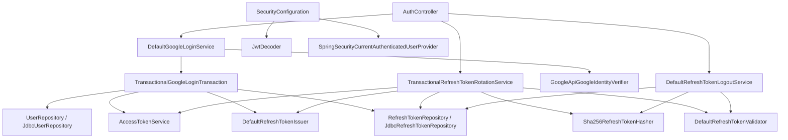

### Backend responsibilities

| Component | Responsibility | Must not do |
| --- | --- | --- |
| `AuthController` | HTTP JSON boundary, request validation, UUID/time creation for auth commands | Google verification internals, hashing, DB transaction logic |
| `DefaultGoogleLoginService` | Reject blank Google ID Token, verify it once, delegate transactional work, retry one duplicate-key first-login race | DB writes directly, issue tokens directly |
| `TransactionalGoogleLoginTransaction` | Find/create `User`, issue Access Token, issue/persist Refresh Token in one transaction | Call Google, expose raw token in logs |
| `GoogleApiGoogleIdentityVerifier` | Verify Google ID Token and map payload to `GoogleIdentity` | Persist users or tokens |
| `NimbusAccessTokenIssuer` | Create signed JWT with issuer, subject, issuedAt, expiresAt | Store JWT in DB |
| `NimbusAccessTokenVerifier` | Verify token through `JwtDecoder` and map `sub` to `AuthenticatedUser` | Replace Spring Security filter chain |
| `DefaultRefreshTokenIssuer` | Generate raw token, hash it, create persisted `RefreshToken` | Persist raw refresh token |
| `TransactionalRefreshTokenRotationService` | Hash lookup, validate, issue new tokens, conditional revoke old token, persist new token | Accept revoked/expired/replayed refresh tokens |
| `DefaultRefreshTokenLogoutService` | Idempotent revoke of an active Refresh Token by raw value | Fail logout for already invalid/missing token |
| `SecurityConfiguration` | Stateless Spring Security, public auth endpoints, JWT protection elsewhere | Business authorization |

## 7. Flutter component map

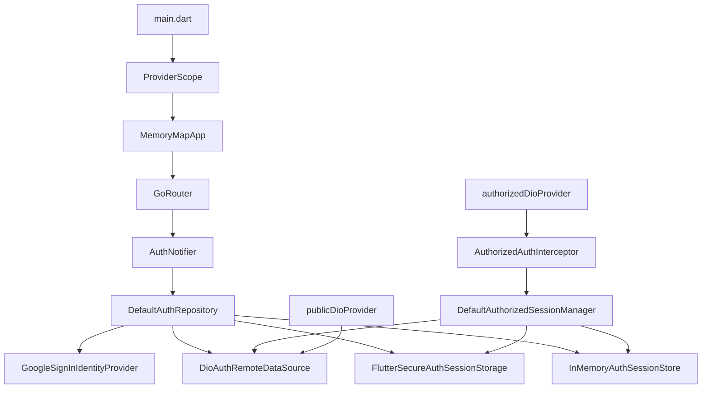

### Flutter responsibilities

| Component | Responsibility | Must not do |
| --- | --- | --- |
| `MemoryMapApp` | App shell, localization, theme, router config | Auth decisions itself |
| `appRouterProvider` | Route user according to `AsyncValue<AuthState>` | Verify tokens or call backend |
| `AuthNotifier` | Async auth state machine, startup restore, login/logout actions, retry restore | Persist tokens directly |
| `DefaultAuthRepository` | Coordinate Google ID Token, backend auth API, secure storage, in-memory session | Call protected APIs |
| `GoogleSignInIdentityProvider` | Initialize Google Sign-In and return ID Token | Persist Google ID Token or call backend |
| `DioAuthRemoteDataSource` | Public auth HTTP calls and response mapping | Add `Authorization` header |
| `FlutterSecureAuthSessionStorage` | Store one versioned session JSON blob under `auth.session.v1` | Interpret auth business state |
| `InMemoryAuthSessionStore` | Keep current session for app runtime and notify changes | Persist to disk |
| `AuthorizedAuthInterceptor` | Inject Bearer token, refresh once on protected `401`, retry replayable request | Handle login/logout endpoints |

## 8. Google login flow

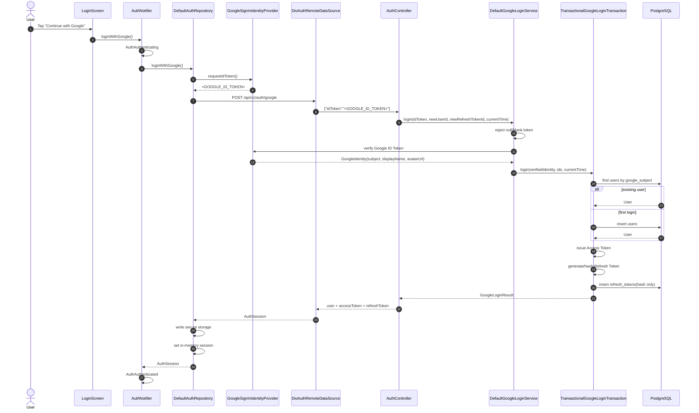

Backend login implementation:

- [AuthController.java](../backend/src/main/java/memory_map/backend/auth/api/AuthController.java)
- [DefaultGoogleLoginService.java](../backend/src/main/java/memory_map/backend/auth/login/DefaultGoogleLoginService.java)
- [TransactionalGoogleLoginTransaction.java](../backend/src/main/java/memory_map/backend/auth/login/TransactionalGoogleLoginTransaction.java)

Flutter login implementation:

- [login_screen.dart](../mobile/lib/features/auth/presentation/login_screen.dart)
- [auth_notifier.dart](../mobile/lib/features/auth/application/auth_notifier.dart)
- [default_auth_repository.dart](../mobile/lib/features/auth/application/default_auth_repository.dart)
- [google_sign_in_identity_provider.dart](../mobile/lib/features/auth/data/google/google_sign_in_identity_provider.dart)
- [dio_auth_remote_data_source.dart](../mobile/lib/features/auth/data/remote/dio_auth_remote_data_source.dart)

## 9. Backend Google login internals

`DefaultGoogleLoginService` performs Google verification outside the database transaction:

1. Rejects `null` or blank `googleIdToken`.
2. Calls `GoogleIdentityVerifier.verify(googleIdToken)`.
3. Calls `GoogleLoginTransaction.login(...)`.
4. If the transactional call throws `DuplicateKeyException`, retries the transactional call once with the same verified identity, same generated UUIDs, and same timestamp.

`TransactionalGoogleLoginTransaction` performs the DB and token work:

1. Searches `users` by `google_subject`.
2. If found, uses the existing `User`.
3. If absent, creates a new `User`.
4. If Google display name is absent or blank, uses the default display name `Memory Map User`.
5. Issues an Access Token for `user.id`.
6. Issues a Refresh Token for `user.id`.
7. Persists only the Refresh Token hash.
8. Returns user plus raw tokens to the controller response.

Existing users are not profile-synced during login. Their `displayName` and `avatarUrl` are not updated by the login transaction.

## 10. Concurrent first-login recovery

The first-login race is handled by combining a unique database constraint with one retry in the login service.

Database constraint:

- [V2__create_users.sql](../backend/src/main/resources/db/migration/V2__create_users.sql) defines `UNIQUE (google_subject)`.

Service behavior:

- [DefaultGoogleLoginService.java](../backend/src/main/java/memory_map/backend/auth/login/DefaultGoogleLoginService.java) catches `DuplicateKeyException` from the transactional login call and retries once.
- Google verification is done before the transactional work, so the same verified identity is reused on retry.

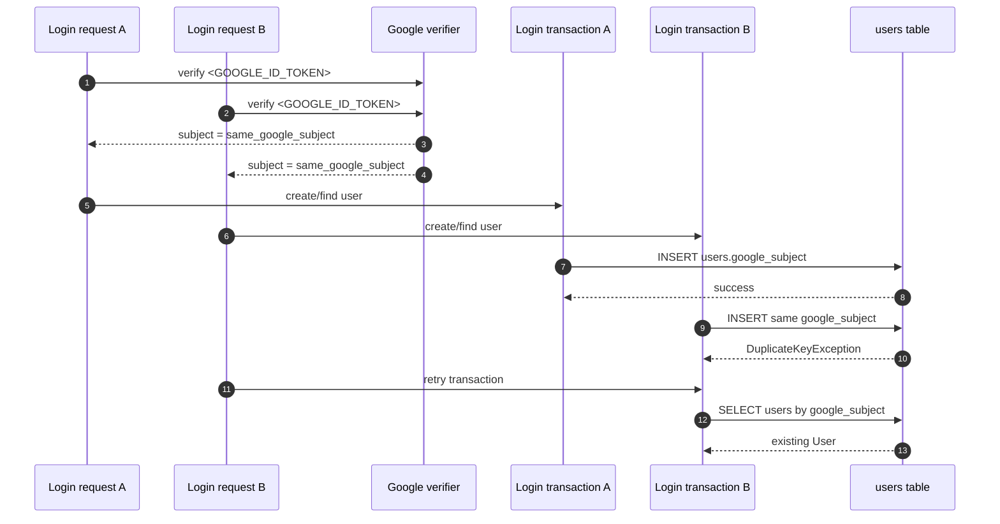

The retry is intentionally narrow. It recovers the expected concurrent first-login race and does not implement a general retry framework.

## 11. Access Token issuance/verification

### Issuance

`NimbusAccessTokenIssuer` creates JWT Access Tokens with:

- `issuer`: `app.auth.jwt.issuer`;
- `subject`: internal User UUID string;
- `issuedAt`: current time passed by caller;
- `expiresAt`: current time plus `app.auth.jwt.access-token-ttl`.

The backend default TTL is `PT15M`.

Relevant files:

- [NimbusAccessTokenIssuer.java](../backend/src/main/java/memory_map/backend/auth/jwt/NimbusAccessTokenIssuer.java)
- [JwtAuthProperties.java](../backend/src/main/java/memory_map/backend/auth/jwt/JwtAuthProperties.java)
- [application.yml](../backend/src/main/resources/application.yml)

### Verification

There are two verification surfaces:

1. `NimbusAccessTokenVerifier` verifies Access Tokens as a service and maps the JWT subject to `AuthenticatedUser`.
2. Spring Security Resource Server verifies protected HTTP requests through the configured `JwtDecoder`.

The `JwtDecoder` is configured with:

- HS256 key built from `app.auth.jwt.secret-base64`;
- timestamp validation;
- issuer validation;
- a custom issued-at validator that requires `iat`.

Relevant files:

- [JwtAccessTokenConfiguration.java](../backend/src/main/java/memory_map/backend/auth/jwt/JwtAccessTokenConfiguration.java)
- [JwtSecretKeyFactory.java](../backend/src/main/java/memory_map/backend/auth/jwt/JwtSecretKeyFactory.java)
- [JwtIssuedAtValidator.java](../backend/src/main/java/memory_map/backend/auth/jwt/JwtIssuedAtValidator.java)
- [NimbusAccessTokenVerifier.java](../backend/src/main/java/memory_map/backend/auth/jwt/NimbusAccessTokenVerifier.java)
- [SecurityConfiguration.java](../backend/src/main/java/memory_map/backend/auth/security/SecurityConfiguration.java)

## 12. Refresh Token model/issuance

Refresh Tokens are generated as 32 random bytes and encoded with URL-safe Base64 without padding.

The backend stores:

- `id`;
- `user_id`;
- `token_hash`;
- `created_at`;
- `expires_at`;
- optional `revoked_at`.

It does not store the raw Refresh Token.

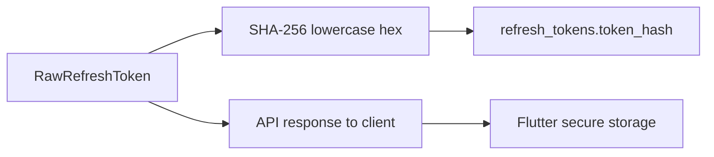

Relevant files:

- [SecureRandomRawRefreshTokenGenerator.java](../backend/src/main/java/memory_map/backend/auth/refresh/SecureRandomRawRefreshTokenGenerator.java)
- [Sha256RefreshTokenHasher.java](../backend/src/main/java/memory_map/backend/auth/refresh/Sha256RefreshTokenHasher.java)
- [DefaultRefreshTokenIssuer.java](../backend/src/main/java/memory_map/backend/auth/refresh/DefaultRefreshTokenIssuer.java)
- [RawRefreshToken.java](../backend/src/main/java/memory_map/backend/auth/refresh/RawRefreshToken.java)
- [RefreshToken.java](../backend/src/main/java/memory_map/backend/auth/domain/RefreshToken.java)
- [V8__create_refresh_tokens.sql](../backend/src/main/resources/db/migration/V8__create_refresh_tokens.sql)

## 13. Session Restore flow

Session Restore runs during `AuthNotifier.build()`.

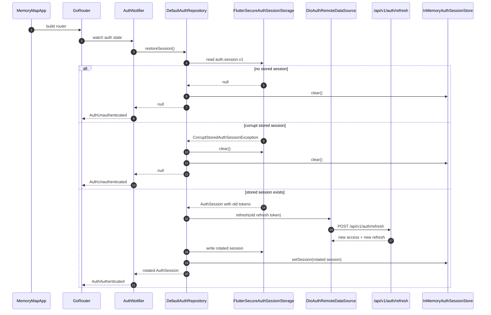

Restore failure policy in `DefaultAuthRepository`:

| Failure | Result |
| --- | --- |
| No stored session | clear in-memory session, return `null` |
| Corrupt stored session | clear storage and in-memory session, return `null`; if clear fails, surface `SecureStorageFailure` |
| Refresh returns 401 | clear storage and in-memory session, return `null` |
| Refresh validation/network/timeout/server/malformed/unknown failure | surface mapped `AuthApplicationException`; stored session is preserved for retry unless write/clear policy says otherwise |
| Rotated session write fails | best-effort clear, clear in-memory session, surface `SecureStorageFailure` |
| Unexpected exception | allowed to become `AsyncError` in `AuthNotifier` |

`authNotifierProvider` disables Riverpod automatic retry:

```dart
retry: (retryCount, error) => null
```

This keeps unexpected restore failures visible as `AsyncError`; retries happen only through `retrySessionRestore()`.

## 14. Refresh Token rotation

Backend rotation endpoint:

```text
POST /api/v1/auth/refresh
```

Request:

```json
{
  "refreshToken": "<REFRESH_TOKEN>"
}
```

Response:

```json
{
  "accessToken": "<ACCESS_TOKEN>",
  "refreshToken": "<REFRESH_TOKEN>"
}
```

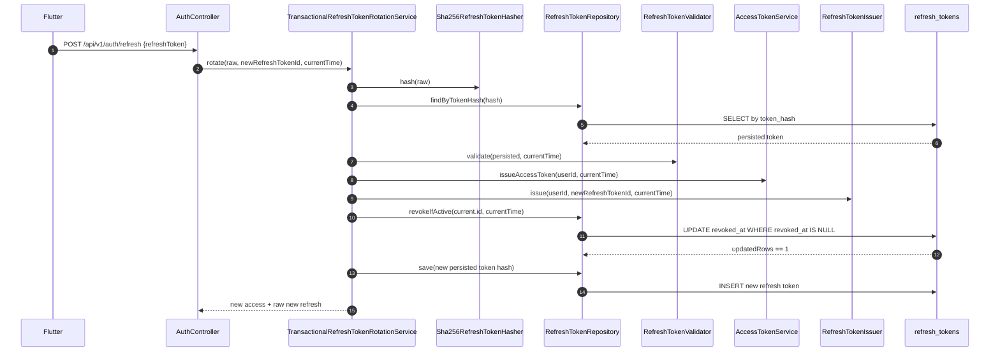

Rotation is transactional in [TransactionalRefreshTokenRotationService.java](../backend/src/main/java/memory_map/backend/auth/refresh/TransactionalRefreshTokenRotationService.java).

The integration test [RefreshTokenRotationServiceIntegrationTest.java](../backend/src/test/java/memory_map/backend/auth/refresh/RefreshTokenRotationServiceIntegrationTest.java) includes rollback coverage when saving the new token fails after old-token revocation.

## 15. Conditional revoke/replay protection

Replay protection depends on `revokeIfActive`.

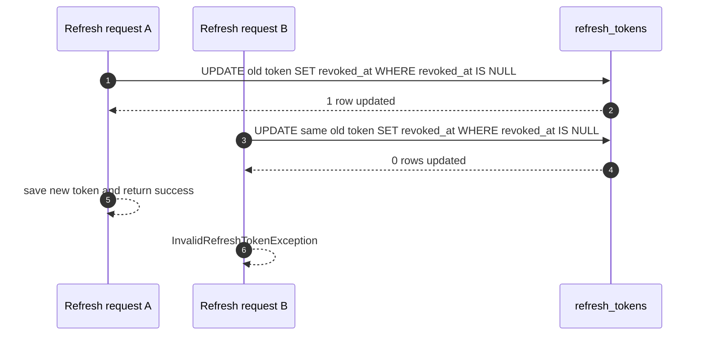

If a token is unknown, revoked, expired, or loses the conditional revoke race, rotation fails with `InvalidRefreshTokenException`. The API maps that to a safe `401 Unauthorized` ProblemDetail body.

Relevant files:

- [JdbcRefreshTokenRepository.java](../backend/src/main/java/memory_map/backend/auth/repository/JdbcRefreshTokenRepository.java)
- [DefaultRefreshTokenValidator.java](../backend/src/main/java/memory_map/backend/auth/refresh/DefaultRefreshTokenValidator.java)
- [InvalidRefreshTokenException.java](../backend/src/main/java/memory_map/backend/auth/refresh/InvalidRefreshTokenException.java)
- [AuthApiExceptionHandler.java](../backend/src/main/java/memory_map/backend/auth/api/AuthApiExceptionHandler.java)

## 16. Automatic Access Token refresh

Automatic refresh is implemented in Flutter authorized networking, not in backend Spring Security.

The authorized client is [authorized_dio_provider.dart](../mobile/lib/features/auth/data/network/authorized_dio_provider.dart). It creates its own Dio instance and attaches [AuthorizedAuthInterceptor](../mobile/lib/features/auth/data/network/authorized_auth_interceptor.dart).

Behavior:

1. Requests to `/api/v1/auth/**` are ignored by the interceptor.
2. Other requests require a current in-memory session.
3. The interceptor injects `Authorization: Bearer <ACCESS_TOKEN>`.
4. If a protected request returns `401`, the interceptor:
   - skips auth endpoints;
   - skips non-replayable `FormData` or `Stream` requests;
   - skips requests already marked as retried;
   - refreshes the current session through `AuthorizedSessionManager`;
   - retries the original request once with the new Access Token.
5. Concurrent refresh attempts share `_refreshInFlight`.
6. If the retried request still returns `401`, the refreshed session is invalidated.

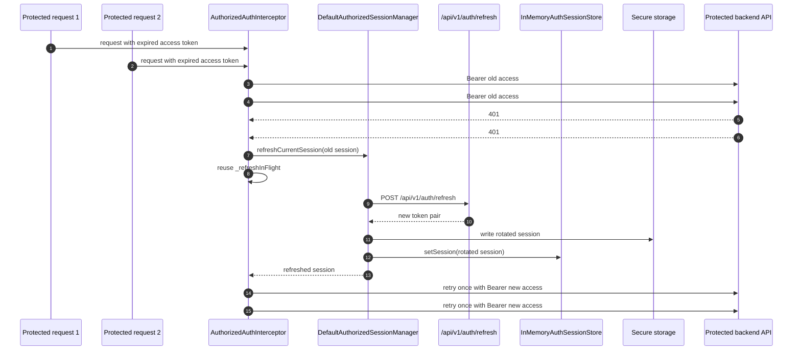

Important distinction:

- Startup restore is user/session initialization.
- Automatic refresh is request recovery after a protected endpoint returns `401`.
- Both use `/api/v1/auth/refresh`, but they are separate orchestration paths.

## 17. Logout flow

Flutter logout is local-first. The raw Refresh Token is captured from the current session, local secure storage is cleared, the in-memory session is cleared, and only then the backend logout endpoint is called.

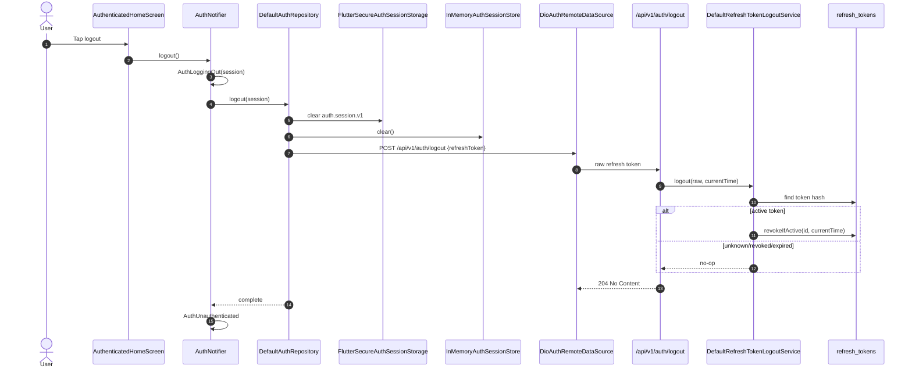

Backend logout behavior:

- unknown token: no-op;
- revoked token: no-op;
- expired token: no-op;
- active token: conditional revoke;
- response: `204 No Content`.

Mobile logout behavior:

- if local clear fails, logout fails with `SecureStorageFailure` and remote logout is not called;
- after local clear succeeds, remote logout failures are ignored as best-effort;
- Google Sign-In is not called during logout.

Relevant tests:

- [DefaultAuthRepository logout tests](../mobile/test/features/auth/application/default_auth_repository_logout_test.dart)
- [DefaultRefreshTokenLogoutServiceTest.java](../backend/src/test/java/memory_map/backend/auth/refresh/DefaultRefreshTokenLogoutServiceTest.java)
- [RefreshTokenLogoutServiceIntegrationTest.java](../backend/src/test/java/memory_map/backend/auth/refresh/RefreshTokenLogoutServiceIntegrationTest.java)

## 18. Spring Security protected request flow

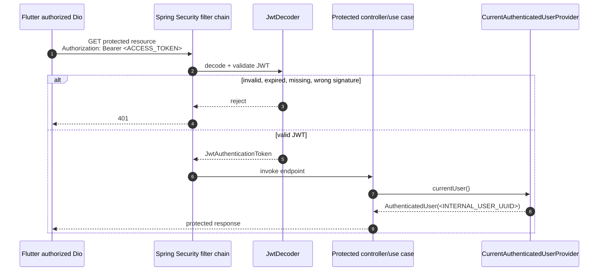

`SecurityConfiguration` uses:

- stateless session management;
- CSRF disabled;
- `/api/v1/auth/**` permit all;
- all other requests authenticated;
- JWT Resource Server;
- form login disabled;
- HTTP Basic disabled;
- Spring logout disabled.

`SpringSecurityCurrentAuthenticatedUserProvider` resolves the internal user UUID from the JWT subject. It rejects missing auth, unauthenticated auth, non-JWT auth, missing subject, blank subject, and non-UUID subject with a safe message.

## 19. REST API contract

Base path:

```text
/api/v1/auth
```

### `POST /api/v1/auth/google`

Purpose: exchange a Google ID Token for a Memory Map session.

Request:

```json
{
  "idToken": "<GOOGLE_ID_TOKEN>"
}
```

Success `200 OK`:

```json
{
  "user": {
    "id": "<INTERNAL_USER_UUID>",
    "displayName": "Memory Map User",
    "avatarUrl": null
  },
  "accessToken": "<ACCESS_TOKEN>",
  "refreshToken": "<REFRESH_TOKEN>"
}
```

Errors:

- `400 Bad Request` for request validation failures such as blank `idToken`;
- `401 Unauthorized` for Google verification failure, with safe `ProblemDetail`.

### `POST /api/v1/auth/refresh`

Purpose: rotate a Refresh Token and receive a new token pair.

Request:

```json
{
  "refreshToken": "<REFRESH_TOKEN>"
}
```

Success `200 OK`:

```json
{
  "accessToken": "<ACCESS_TOKEN>",
  "refreshToken": "<REFRESH_TOKEN>"
}
```

Errors:

- `400 Bad Request` for blank `refreshToken`;
- `401 Unauthorized` for unknown, expired, revoked, or replayed Refresh Token.

### `POST /api/v1/auth/logout`

Purpose: revoke the supplied Refresh Token if it is currently active.

Request:

```json
{
  "refreshToken": "<REFRESH_TOKEN>"
}
```

Success:

```text
204 No Content
```

Errors:

- `400 Bad Request` for blank `refreshToken`;
- unknown, revoked, and expired tokens are treated as idempotent no-op success by the service path.

## 20. Database model

### `users`

Defined in [V2__create_users.sql](../backend/src/main/resources/db/migration/V2__create_users.sql).

| Column | Type | Null | Notes |
| --- | --- | --- | --- |
| `id` | `UUID` | no | Primary key; migration has `DEFAULT gen_random_uuid()`, while current application code passes generated UUIDs explicitly |
| `google_subject` | `VARCHAR(255)` | no | Unique; maps one Google account to one User |
| `display_name` | `VARCHAR(255)` | no | Comes from Google name or backend default during first login |
| `avatar_url` | `TEXT` | yes | Optional Google picture |
| `created_at` | `TIMESTAMPTZ` | no | Migration default exists; current application code passes value |
| `updated_at` | `TIMESTAMPTZ` | no | Migration default exists; current application code passes value |

### `refresh_tokens`

Defined in [V8__create_refresh_tokens.sql](../backend/src/main/resources/db/migration/V8__create_refresh_tokens.sql).

| Column | Type | Null | Notes |
| --- | --- | --- | --- |
| `id` | `UUID` | no | Primary key; generated by controller and passed into service |
| `user_id` | `UUID` | no | FK to `users(id)` |
| `token_hash` | `VARCHAR(255)` | no | Unique SHA-256 lowercase hex hash of raw Refresh Token |
| `created_at` | `TIMESTAMPTZ` | no | Issuance time |
| `expires_at` | `TIMESTAMPTZ` | no | `created_at + refresh-token.ttl` |
| `revoked_at` | `TIMESTAMPTZ` | yes | Set on refresh rotation or logout |

No raw Refresh Token column exists.

## 21. Configuration reference

### Backend

Source:

- [application.yml](../backend/src/main/resources/application.yml)
- [application-local.example.yml](../backend/config/application-local.example.yml)

| Property | Default/source | Purpose |
| --- | --- | --- |
| `app.auth.google.client-id` | `${GOOGLE_CLIENT_ID:}` | Google OAuth Web Client ID expected as JWT audience |
| `app.auth.jwt.issuer` | `memory-map-backend` | JWT issuer claim and validator value |
| `app.auth.jwt.access-token-ttl` | `PT15M` | Access Token lifetime |
| `app.auth.jwt.secret-base64` | `${JWT_SECRET_BASE64:}` | Base64-encoded HS256 secret, at least 32 decoded bytes |
| `app.auth.refresh-token.ttl` | `P30D` | Refresh Token lifetime |
| `spring.config.import` | `optional:file:./config/application-local.yml` | Local uncommitted backend config import |

Example placeholders:

```yaml
app:
  auth:
    google:
      client-id: <WEB_GOOGLE_CLIENT_ID>
    jwt:
      issuer: memory-map-backend
      access-token-ttl: PT15M
      secret-base64: <JWT_SECRET_BASE64>
    refresh-token:
      ttl: P30D
```

### Flutter

Source:

- [app_config.dart](../mobile/lib/core/config/app_config.dart)
- [pubspec.yaml](../mobile/pubspec.yaml)

| Compile-time key | Default | Purpose |
| --- | --- | --- |
| `MM_API_BASE_URL` | `http://10.0.2.2:8080` | Backend base URL for Android Emulator host loopback |
| `MM_GOOGLE_SERVER_CLIENT_ID` | empty string | Google Web Client ID passed as `serverClientId` |
| `MM_GOOGLE_IOS_CLIENT_ID` | empty string | Optional iOS client ID passed as `clientId`; blank becomes `null` |

Flutter dependencies used by auth:

- `flutter_riverpod`;
- `dio`;
- `go_router`;
- `flutter_secure_storage`;
- `google_sign_in`;
- `flutter_svg`;
- `intl` / Flutter localization.

## 22. Local development startup

This guide does not run commands. The expected local startup sequence for a developer is:

### Backend

1. Create `backend/config/application-local.yml` from [application-local.example.yml](../backend/config/application-local.example.yml).
2. Fill database and MinIO local values.
3. Fill auth placeholders:

```yaml
app:
  auth:
    google:
      client-id: <WEB_GOOGLE_CLIENT_ID>
    jwt:
      secret-base64: <JWT_SECRET_BASE64>
```

4. Start required local services from the project infrastructure setup.
5. Start the backend from the `backend` module.

Useful backend checks to run locally:

```powershell
cd backend
./gradlew test
```

### Flutter

For Android Emulator talking to backend on the host machine:

```powershell
cd mobile
flutter run --dart-define=MM_GOOGLE_SERVER_CLIENT_ID=<WEB_GOOGLE_CLIENT_ID>
```

If the backend URL is not `http://10.0.2.2:8080`, pass:

```powershell
flutter run `
  --dart-define=MM_API_BASE_URL=http://10.0.2.2:8080 `
  --dart-define=MM_GOOGLE_SERVER_CLIENT_ID=<WEB_GOOGLE_CLIENT_ID>
```

For iOS, also pass `MM_GOOGLE_IOS_CLIENT_ID` when the platform setup requires an iOS client ID:

```powershell
flutter run `
  --dart-define=MM_GOOGLE_SERVER_CLIENT_ID=<WEB_GOOGLE_CLIENT_ID> `
  --dart-define=MM_GOOGLE_IOS_CLIENT_ID=<WEB_GOOGLE_CLIENT_ID>
```

Use the real platform-specific value in place of the placeholder. Do not commit local secrets or generated local config.

Useful Flutter checks to run locally:

```powershell
cd mobile
flutter analyze
flutter test
flutter run
```

## 23. Google Cloud setup summary

The implemented code expects:

1. A Google OAuth Web Client ID for backend ID Token audience validation.
2. The same Web Client ID passed to Flutter as `MM_GOOGLE_SERVER_CLIENT_ID`.
3. Optional iOS client ID passed to Flutter as `MM_GOOGLE_IOS_CLIENT_ID` when required by the Google Sign-In platform setup.
4. Backend property `app.auth.google.client-id` configured with the Web Client ID.

No Google client secret is required by the implemented mobile login flow. The backend verifies ID Tokens; it does not perform an OAuth authorization-code exchange.

Do not add Google OAuth files or secrets to this repository unless a future scoped task explicitly requires that.

## 24. Failure model

### Backend failures

| Condition | Backend exception/result | HTTP behavior |
| --- | --- | --- |
| Blank Google ID Token request body | validation error | `400 Bad Request` |
| Google token invalid, missing payload, invalid subject, verifier failure | `GoogleIdentityVerificationException` | `401 Unauthorized` safe ProblemDetail |
| Blank Refresh Token request body | validation error | `400 Bad Request` |
| Unknown/revoked/expired/replayed Refresh Token during refresh | `InvalidRefreshTokenException` | `401 Unauthorized` safe ProblemDetail |
| Unknown/revoked/expired Refresh Token during logout | no-op | `204 No Content` |
| Missing/invalid/expired protected Access Token | Spring Security rejection | `401 Unauthorized` |

### Flutter remote mappings

| Dio condition/status | Auth remote exception |
| --- | --- |
| `400` | `AuthRemoteValidationException` |
| `401` | `AuthRemoteUnauthorizedException` |
| `5xx` | `AuthRemoteServerException` |
| connection timeout, send timeout, receive timeout, transform timeout | `AuthRemoteTimeoutException` |
| connection error or bad certificate | `AuthRemoteNetworkException` |
| malformed success response | `AuthRemoteMalformedResponseException` |
| cancellation, unknown Dio failure, other status | `AuthRemoteUnknownException` |

### Flutter application mappings

| Source failure | UI/application failure |
| --- | --- |
| Google cancellation | `AuthCancelled`, mapped to unauthenticated state by `AuthNotifier` |
| Google unavailable | `GoogleAuthenticationUnavailable` |
| Google authentication failed | `GoogleAuthenticationFailed` |
| Backend `401` | `BackendUnauthorized` |
| Request validation | `RequestValidationFailed` |
| Network unavailable | `NetworkUnavailable` |
| Timeout | `RequestTimedOut` |
| Server failure | `ServerFailure` |
| Secure storage failure | `SecureStorageFailure` |
| Corrupt stored session | usually cleared and treated as no session; clear failure becomes `SecureStorageFailure` |
| Malformed/unknown remote response | `UnknownAuthFailure` |

## 25. Sensitive data/logging rules

Never log or expose:

- `<GOOGLE_ID_TOKEN>`;
- `<ACCESS_TOKEN>`;
- `<REFRESH_TOKEN>`;
- `<JWT_SECRET_BASE64>`;
- `refresh_tokens.token_hash`;
- private emails or personal Google profile data outside the minimal implemented fields.

Implemented redaction points include:

- backend request/response DTO `toString()` methods for token-carrying records;
- backend `RawRefreshToken`, `IssuedRefreshToken`, `RefreshTokenRotationResult` style objects;
- Flutter `AuthTokens`, `AuthSession`, `StoredAuthSession`, `InMemoryAuthSessionStore`;
- safe backend auth error responses that avoid exception messages and raw tokens;
- safe Flutter localized auth failure messages.

Be careful with `AuthUser.toString()` on Flutter: it includes `id`, `displayName`, and `avatarUrl`. It does not include tokens, but it may include user-visible profile data.

## 26. Transaction boundaries

| Flow | Transaction boundary | Notes |
| --- | --- | --- |
| Google verification | no DB transaction | External Google verification happens before DB login transaction |
| Google login DB/token persistence | `TransactionalGoogleLoginTransaction.login(...)` | Find/create user and persist Refresh Token happen transactionally |
| Duplicate first-login retry | outside transaction, in `DefaultGoogleLoginService` | Retries the transactional component once after `DuplicateKeyException` |
| Refresh Token rotation | `TransactionalRefreshTokenRotationService.rotate(...)` | Hash lookup, validation, Access Token issue, new Refresh Token issue, conditional revoke, and save happen in one transaction |
| Rotation rollback | integration-tested | If saving the new token fails after revocation, old-token revocation is rolled back |
| Logout | no explicit `@Transactional` on `DefaultRefreshTokenLogoutService` | Uses repository calls; idempotent service behavior reduces operational risk |
| Spring Security JWT verification | request filter chain, no app DB transaction | Stateless JWT validation before protected endpoint invocation |

## 27. Concurrency guarantees

Backend:

- `users.google_subject` unique constraint prevents duplicate users for the same Google subject.
- `DefaultGoogleLoginService` retries once after duplicate-key first-login race.
- `refresh_tokens.token_hash` unique constraint prevents duplicate persisted token hashes.
- `revokeIfActive` prevents successful double-use of the same Refresh Token during rotation.
- refresh rotation transaction rolls back old-token revocation if new-token save fails.

Flutter:

- `GoogleSignInIdentityProvider` reuses one initialization future for repeated requests.
- `AuthorizedAuthInterceptor` uses `_refreshInFlight` to share a single refresh across concurrent protected `401` responses.
- `DefaultAuthorizedSessionManager` reuses an already-updated in-memory session when the failed session is stale.
- Session store changes update `AuthNotifier` background state without exposing a visible "background refreshing" state.

## 28. Test strategy/coverage map

### Backend

| Area | Tests |
| --- | --- |
| User persistence and unique Google subject | [UserRepositoryTest.java](../backend/src/test/java/memory_map/backend/user/repository/UserRepositoryTest.java) |
| Auth API contract and safe DTOs | [AuthControllerTest.java](../backend/src/test/java/memory_map/backend/auth/api/AuthControllerTest.java), [AuthSensitiveDtoTest.java](../backend/src/test/java/memory_map/backend/auth/api/AuthSensitiveDtoTest.java), [AuthApiExceptionHandlerTest.java](../backend/src/test/java/memory_map/backend/auth/api/AuthApiExceptionHandlerTest.java) |
| HTTP integration login/refresh/logout | [AuthControllerIntegrationTest.java](../backend/src/test/java/memory_map/backend/auth/api/AuthControllerIntegrationTest.java) |
| Google ID Token verifier | [GoogleApiGoogleIdentityVerifierTest.java](../backend/src/test/java/memory_map/backend/auth/google/GoogleApiGoogleIdentityVerifierTest.java) |
| Google login transaction and duplicate-key retry | [DefaultGoogleLoginServiceTest.java](../backend/src/test/java/memory_map/backend/auth/login/DefaultGoogleLoginServiceTest.java), [TransactionalGoogleLoginTransactionTest.java](../backend/src/test/java/memory_map/backend/auth/login/TransactionalGoogleLoginTransactionTest.java), [GoogleLoginServiceIntegrationTest.java](../backend/src/test/java/memory_map/backend/auth/login/GoogleLoginServiceIntegrationTest.java) |
| JWT properties, secret, issue, verify | [JwtAuthPropertiesTest.java](../backend/src/test/java/memory_map/backend/auth/jwt/JwtAuthPropertiesTest.java), [JwtSecretKeyFactoryTest.java](../backend/src/test/java/memory_map/backend/auth/jwt/JwtSecretKeyFactoryTest.java), [NimbusAccessTokenIssuerTest.java](../backend/src/test/java/memory_map/backend/auth/jwt/NimbusAccessTokenIssuerTest.java), [NimbusAccessTokenVerifierTest.java](../backend/src/test/java/memory_map/backend/auth/jwt/NimbusAccessTokenVerifierTest.java), [DefaultAccessTokenServiceTest.java](../backend/src/test/java/memory_map/backend/auth/jwt/DefaultAccessTokenServiceTest.java) |
| Refresh token generation/hash/validation/rotation/logout | [SecureRandomRawRefreshTokenGeneratorTest.java](../backend/src/test/java/memory_map/backend/auth/refresh/SecureRandomRawRefreshTokenGeneratorTest.java), [Sha256RefreshTokenHasherTest.java](../backend/src/test/java/memory_map/backend/auth/refresh/Sha256RefreshTokenHasherTest.java), [DefaultRefreshTokenIssuerTest.java](../backend/src/test/java/memory_map/backend/auth/refresh/DefaultRefreshTokenIssuerTest.java), [DefaultRefreshTokenValidatorTest.java](../backend/src/test/java/memory_map/backend/auth/refresh/DefaultRefreshTokenValidatorTest.java), [TransactionalRefreshTokenRotationServiceTest.java](../backend/src/test/java/memory_map/backend/auth/refresh/TransactionalRefreshTokenRotationServiceTest.java), [RefreshTokenRotationServiceIntegrationTest.java](../backend/src/test/java/memory_map/backend/auth/refresh/RefreshTokenRotationServiceIntegrationTest.java), [DefaultRefreshTokenLogoutServiceTest.java](../backend/src/test/java/memory_map/backend/auth/refresh/DefaultRefreshTokenLogoutServiceTest.java), [RefreshTokenLogoutServiceIntegrationTest.java](../backend/src/test/java/memory_map/backend/auth/refresh/RefreshTokenLogoutServiceIntegrationTest.java) |
| Spring Security and current user resolution | [SecurityConfigurationTest.java](../backend/src/test/java/memory_map/backend/auth/security/SecurityConfigurationTest.java), [SpringSecurityCurrentAuthenticatedUserProviderTest.java](../backend/src/test/java/memory_map/backend/auth/security/SpringSecurityCurrentAuthenticatedUserProviderTest.java), [CurrentAuthenticatedUserExceptionTest.java](../backend/src/test/java/memory_map/backend/auth/security/CurrentAuthenticatedUserExceptionTest.java) |
| Refresh Token repository integration | [JdbcRefreshTokenRepositoryTest.java](../backend/src/test/java/memory_map/backend/auth/repository/JdbcRefreshTokenRepositoryTest.java) |

### Flutter

| Area | Tests |
| --- | --- |
| App shell and root routing | [widget_test.dart](../mobile/test/widget_test.dart), [router_test.dart](../mobile/test/app/router_test.dart) |
| Localization | [app_localizations_test.dart](../mobile/test/l10n/app_localizations_test.dart) |
| Auth domain values and redaction | [auth_user_test.dart](../mobile/test/features/auth/domain/auth_user_test.dart), [auth_tokens_test.dart](../mobile/test/features/auth/domain/auth_tokens_test.dart), [auth_session_test.dart](../mobile/test/features/auth/domain/auth_session_test.dart), [auth_failure_test.dart](../mobile/test/features/auth/domain/auth_failure_test.dart), [google_identity_exception_test.dart](../mobile/test/features/auth/domain/google_identity_exception_test.dart) |
| Google identity provider | [google_sign_in_identity_provider_test.dart](../mobile/test/features/auth/data/google/google_sign_in_identity_provider_test.dart) |
| Auth DTOs and remote data source | [auth_dto_test.dart](../mobile/test/features/auth/data/remote/dto/auth_dto_test.dart), [dio_auth_remote_data_source_test.dart](../mobile/test/features/auth/data/remote/dio_auth_remote_data_source_test.dart) |
| Secure session storage | [stored_auth_session_test.dart](../mobile/test/features/auth/data/storage/stored_auth_session_test.dart), [flutter_secure_auth_session_storage_test.dart](../mobile/test/features/auth/data/storage/flutter_secure_auth_session_storage_test.dart) |
| Login/restore/logout repository orchestration | [default_auth_repository_test.dart](../mobile/test/features/auth/application/default_auth_repository_test.dart), [default_auth_repository_restore_test.dart](../mobile/test/features/auth/application/default_auth_repository_restore_test.dart), [default_auth_repository_logout_test.dart](../mobile/test/features/auth/application/default_auth_repository_logout_test.dart) |
| Auth notifier state machine | [auth_notifier_test.dart](../mobile/test/features/auth/application/auth_notifier_test.dart), [auth_state_test.dart](../mobile/test/features/auth/application/auth_state_test.dart), [auth_application_exception_test.dart](../mobile/test/features/auth/application/auth_application_exception_test.dart) |
| Automatic authorized refresh | [authorized_auth_interceptor_test.dart](../mobile/test/features/auth/data/network/authorized_auth_interceptor_test.dart), [default_authorized_session_manager_test.dart](../mobile/test/features/auth/application/default_authorized_session_manager_test.dart) |
| Auth UI screens and safe messages | [login_screen_test.dart](../mobile/test/features/auth/presentation/login_screen_test.dart), [auth_checking_screen_test.dart](../mobile/test/features/auth/presentation/auth_checking_screen_test.dart), [auth_restore_failure_screen_test.dart](../mobile/test/features/auth/presentation/auth_restore_failure_screen_test.dart), [auth_unexpected_error_screen_test.dart](../mobile/test/features/auth/presentation/auth_unexpected_error_screen_test.dart), [authenticated_home_screen_test.dart](../mobile/test/features/auth/presentation/authenticated_home_screen_test.dart), [auth_failure_message_test.dart](../mobile/test/features/auth/presentation/auth_failure_message_test.dart) |

## 29. How to trace a request in code

### Google login

1. Flutter UI: [login_screen.dart](../mobile/lib/features/auth/presentation/login_screen.dart)
2. State transition: [auth_notifier.dart](../mobile/lib/features/auth/application/auth_notifier.dart)
3. Application orchestration: [default_auth_repository.dart](../mobile/lib/features/auth/application/default_auth_repository.dart)
4. Google ID Token provider: [google_sign_in_identity_provider.dart](../mobile/lib/features/auth/data/google/google_sign_in_identity_provider.dart)
5. Remote call: [dio_auth_remote_data_source.dart](../mobile/lib/features/auth/data/remote/dio_auth_remote_data_source.dart)
6. Backend API: [AuthController.java](../backend/src/main/java/memory_map/backend/auth/api/AuthController.java)
7. Backend service: [DefaultGoogleLoginService.java](../backend/src/main/java/memory_map/backend/auth/login/DefaultGoogleLoginService.java)
8. Transaction: [TransactionalGoogleLoginTransaction.java](../backend/src/main/java/memory_map/backend/auth/login/TransactionalGoogleLoginTransaction.java)
9. User repository: [JdbcUserRepository.java](../backend/src/main/java/memory_map/backend/user/repository/JdbcUserRepository.java)
10. Refresh repository: [JdbcRefreshTokenRepository.java](../backend/src/main/java/memory_map/backend/auth/repository/JdbcRefreshTokenRepository.java)

### Session restore

1. Provider build: [auth_notifier.dart](../mobile/lib/features/auth/application/auth_notifier.dart)
2. Storage read and refresh orchestration: [default_auth_repository.dart](../mobile/lib/features/auth/application/default_auth_repository.dart)
3. Stored JSON mapping: [stored_auth_session.dart](../mobile/lib/features/auth/data/storage/stored_auth_session.dart)
4. Secure storage adapter: [flutter_secure_auth_session_storage.dart](../mobile/lib/features/auth/data/storage/flutter_secure_auth_session_storage.dart)
5. Remote refresh: [dio_auth_remote_data_source.dart](../mobile/lib/features/auth/data/remote/dio_auth_remote_data_source.dart)
6. Backend rotation: [TransactionalRefreshTokenRotationService.java](../backend/src/main/java/memory_map/backend/auth/refresh/TransactionalRefreshTokenRotationService.java)

### Protected request

1. Use `authorizedDioProvider`: [authorized_dio_provider.dart](../mobile/lib/features/auth/data/network/authorized_dio_provider.dart)
2. Bearer injection/retry: [authorized_auth_interceptor.dart](../mobile/lib/features/auth/data/network/authorized_auth_interceptor.dart)
3. Backend JWT security: [SecurityConfiguration.java](../backend/src/main/java/memory_map/backend/auth/security/SecurityConfiguration.java)
4. Current user lookup inside protected backend code: [SpringSecurityCurrentAuthenticatedUserProvider.java](../backend/src/main/java/memory_map/backend/auth/security/SpringSecurityCurrentAuthenticatedUserProvider.java)

## 30. How to add protected endpoint

Backend protected endpoints are protected by default because [SecurityConfiguration.java](../backend/src/main/java/memory_map/backend/auth/security/SecurityConfiguration.java) permits only `/api/v1/auth/**` and authenticates every other request.

When adding a protected endpoint:

1. Do not add it under `/api/v1/auth/**` unless it is intentionally public auth API.
2. Inject/use `CurrentAuthenticatedUserProvider` when endpoint/application code needs the current internal user id.
3. Treat `AuthenticatedUser.userId()` as the internal User UUID.
4. Do not parse JWT manually inside controllers.
5. Do not use Google subject or email for authorization.
6. Keep business authorization separate from authentication.
7. On Flutter, call protected endpoints through `authorizedDioProvider`, not `publicDioProvider`.
8. Do not manually refresh Access Tokens in feature code; let `AuthorizedAuthInterceptor` handle protected `401` responses.
9. Do not send Refresh Tokens to protected business endpoints.

Minimal backend pattern:

```java
@RestController
@RequestMapping("/api/v1/example")
class ExampleController {
    private final CurrentAuthenticatedUserProvider currentUserProvider;

    ExampleController(CurrentAuthenticatedUserProvider currentUserProvider) {
        this.currentUserProvider = currentUserProvider;
    }

    @GetMapping
    ExampleResponse example() {
        AuthenticatedUser user = currentUserProvider.currentUser();
        return new ExampleResponse(user.userId());
    }
}
```

Minimal Flutter rule:

```dart
final dio = ref.watch(authorizedDioProvider);
```

## 31. Common mistakes

- Sending Google ID Token as a Bearer token to protected backend endpoints.
- Treating Google subject as the application user id.
- Persisting raw Refresh Tokens in backend storage.
- Adding `Authorization` to `/api/v1/auth/refresh` or `/api/v1/auth/logout`.
- Calling `/api/v1/auth/refresh` from feature code instead of using repository/session-manager boundaries.
- Retrying non-replayable `FormData` or `Stream` requests after `401`.
- Updating existing user profile fields during login without a scoped product decision.
- Logging DTOs with raw token fields.
- Reading `AsyncValue` as data without checking `asData?.value`.
- Assuming startup restore and automatic `401` refresh are the same flow.
- Adding local database/session caches on mobile; current MVP is online-first and uses secure storage only for auth session.

## 32. Troubleshooting

### Login button reports Google unavailable

Check:

- `MM_GOOGLE_SERVER_CLIENT_ID` is provided and not blank.
- Platform Google Sign-In setup is valid.
- The platform supports interactive `authenticate()`.
- `MM_GOOGLE_IOS_CLIENT_ID` is provided on iOS if required.

Relevant code:

- [google_sign_in_identity_provider.dart](../mobile/lib/features/auth/data/google/google_sign_in_identity_provider.dart)
- [flutter_google_sign_in_client.dart](../mobile/lib/features/auth/data/google/flutter_google_sign_in_client.dart)

### Backend returns `401` for Google login

Check:

- backend `app.auth.google.client-id` matches `<WEB_GOOGLE_CLIENT_ID>`;
- Flutter passes the same Web Client ID as `MM_GOOGLE_SERVER_CLIENT_ID`;
- the token sent is a Google ID Token, not an Access Token;
- the ID Token audience matches the backend verifier audience.

Relevant code:

- [GoogleIdentityVerifierConfiguration.java](../backend/src/main/java/memory_map/backend/auth/google/GoogleIdentityVerifierConfiguration.java)
- [GoogleApiGoogleIdentityVerifier.java](../backend/src/main/java/memory_map/backend/auth/google/GoogleApiGoogleIdentityVerifier.java)

### Protected endpoint returns `401`

Check:

- request uses `authorizedDioProvider`;
- request is not under `/api/v1/auth/**`;
- Access Token is present and not expired;
- backend `JWT_SECRET_BASE64` and issuer config match the token issuer;
- JWT includes `sub`, `iat`, and `exp`.

Relevant code:

- [authorized_auth_interceptor.dart](../mobile/lib/features/auth/data/network/authorized_auth_interceptor.dart)
- [JwtAccessTokenConfiguration.java](../backend/src/main/java/memory_map/backend/auth/jwt/JwtAccessTokenConfiguration.java)
- [SecurityConfiguration.java](../backend/src/main/java/memory_map/backend/auth/security/SecurityConfiguration.java)

### Session restore keeps returning login

Check:

- secure storage has a valid `auth.session.v1` JSON blob;
- stored Refresh Token is not expired/revoked/already rotated;
- backend `/api/v1/auth/refresh` returns `200`;
- if backend returns `401`, Flutter clears local session and treats restore as unauthenticated.

Relevant code:

- [default_auth_repository.dart](../mobile/lib/features/auth/application/default_auth_repository.dart)
- [flutter_secure_auth_session_storage.dart](../mobile/lib/features/auth/data/storage/flutter_secure_auth_session_storage.dart)

### Automatic refresh does not retry a request

Check:

- request was sent through `authorizedDioProvider`;
- response status is exactly `401`;
- request is not an auth endpoint;
- request data is not `FormData` or `Stream`;
- request was not already marked as retried;
- `AuthorizedSessionManager` can refresh and persist the rotated session.

Relevant code:

- [authorized_auth_interceptor.dart](../mobile/lib/features/auth/data/network/authorized_auth_interceptor.dart)
- [default_authorized_session_manager.dart](../mobile/lib/features/auth/application/default_authorized_session_manager.dart)

### Logout does not revoke token remotely

Check:

- local secure storage clear succeeds first;
- remote logout call reaches `/api/v1/auth/logout`;
- unknown/revoked/expired tokens are intentionally idempotent no-op on backend;
- mobile intentionally ignores remote logout failures after local clear.

Relevant code:

- [default_auth_repository.dart](../mobile/lib/features/auth/application/default_auth_repository.dart)
- [DefaultRefreshTokenLogoutService.java](../backend/src/main/java/memory_map/backend/auth/refresh/DefaultRefreshTokenLogoutService.java)

## 33. Security invariants checklist

Before merging auth-related changes, verify:

- [ ] No raw Google ID Token is logged.
- [ ] No raw Access Token is logged.
- [ ] No raw Refresh Token is logged.
- [ ] No Refresh Token hash is exposed through REST API.
- [ ] Google subject is not returned to Flutter.
- [ ] JWT subject remains internal User UUID.
- [ ] `/api/v1/auth/**` remains public and all other endpoints remain authenticated.
- [ ] Refresh Token rotation revokes old token conditionally.
- [ ] Rotation writes only hashed Refresh Tokens to PostgreSQL.
- [ ] Mobile stores auth session only through secure storage.
- [ ] Mobile public auth calls use `publicDioProvider`.
- [ ] Mobile protected calls use `authorizedDioProvider`.
- [ ] Auth interceptor does not refresh auth endpoints.
- [ ] Auth interceptor retries only replayable requests and only once.
- [ ] Local logout clears secure storage before best-effort remote logout.
- [ ] UI failure messages stay safe and localized.
- [ ] Tests do not call real Google, network, or platform channels unless explicitly scoped as integration/E2E.

## 34. Known gaps/future work

These items describe visible gaps or follow-up candidates. They are not requirements for the current implementation.

1. There is no committed `backend/config/application-local.yml`; only [application-local.example.yml](../backend/config/application-local.example.yml) exists. Developers must create a local ignored config or provide environment variables.
2. `users.id`, `users.created_at`, and `users.updated_at` have database defaults, while current domain/repository code passes UUIDs and timestamps explicitly. This is not a runtime conflict, but it is worth keeping documented so developers do not assume the database is the primary generator in current auth flows.
3. `DefaultRefreshTokenLogoutService` has no explicit `@Transactional` annotation. The current implementation is idempotent and uses a single conditional revoke for active tokens, but logout does not have the same explicit service-level transaction boundary as login transaction and refresh rotation.
4. Access Tokens are stateless. There is no Access Token denylist. Logout revokes Refresh Tokens but already-issued Access Tokens remain valid until expiry.
5. Refresh Token family/session-device metadata is not implemented. The schema stores individual tokens, not device names, token families, or IP/user-agent metadata.
6. Mobile automatic refresh is covered by interceptor/session-manager tests. A full end-to-end protected business endpoint flow should be verified when the first real protected feature endpoint is implemented.
7. Existing login does not sync display name or avatar for an already-existing user. That is current behavior, not a bug.
8. Authenticated home is a minimal post-login screen. It is not the final Memory Map product home.

## 35. Glossary

| Term | Meaning |
| --- | --- |
| Google ID Token | JWT issued by Google after Google Sign-In; sent to backend for verification |
| Google subject | Stable Google account identifier from ID Token `sub` claim; stored as `users.google_subject` |
| Internal User UUID | Memory Map user id stored as `users.id`; used as backend JWT subject |
| Access Token | Short-lived backend JWT used in `Authorization: Bearer` header |
| Refresh Token | Long-lived opaque random token used only to obtain a rotated token pair |
| Refresh Token hash | SHA-256 lowercase hex hash of raw Refresh Token stored in PostgreSQL |
| Rotation | Replacing a Refresh Token with a new raw token and revoking the previous token |
| Conditional revoke | Atomic update that succeeds only if `revoked_at IS NULL` |
| Session Restore | Startup flow that validates stored session by rotating Refresh Token |
| Automatic refresh | Dio interceptor flow that refreshes tokens after protected endpoint `401` |
| Public Dio | Flutter Dio client without auth interceptor, used for `/api/v1/auth/**` |
| Authorized Dio | Flutter Dio client with auth interceptor, used for protected endpoints |

## 36. Source index

### Documentation sources

- [03-domain-model.docx](./03-domain-model.docx)
- [04-use-cases.docx](./04-use-cases.docx)
- [05-business-rules-and-domain-policies.docx](./05-business-rules-and-domain-policies.docx)
- [06-PostgreSQL-Data-Model-v1.docx](./06-PostgreSQL-Data-Model-v1.docx)
- [07-rest-api-v1.docx](./07-rest-api-v1.docx)
- [08-spring-boot-backend-architecture.docx](./08-spring-boot-backend-architecture.docx)
- [09-security-architecture.docx](./09-security-architecture.docx)
- [10-flutter-architecture.docx](./10-flutter-architecture.docx)
- [11-mvp-development-roadmap.docx](./11-mvp-development-roadmap.docx)
- [12-production-architecture.docx](./12-production-architecture.docx)
- [13-development-guidelines.docx](./13-development-guidelines.docx)
- [14-adr-decisions.docx](./14-adr-decisions.docx)
- [16-development-guidelines.docx](./16-development-guidelines.docx)
- [17-infrastructure-guidelines.docx](./17-infrastructure-guidelines.docx)
- [18-project-bootstrap.docx](./18-project-bootstrap.docx)
- [19-mobile-screens-and-ux-flows.docx](./19-mobile-screens-and-ux-flows.docx)

### Backend production sources

- [AuthController.java](../backend/src/main/java/memory_map/backend/auth/api/AuthController.java)
- [AuthApiExceptionHandler.java](../backend/src/main/java/memory_map/backend/auth/api/AuthApiExceptionHandler.java)
- [GoogleLoginRequest.java](../backend/src/main/java/memory_map/backend/auth/api/GoogleLoginRequest.java)
- [RefreshTokenRequest.java](../backend/src/main/java/memory_map/backend/auth/api/RefreshTokenRequest.java)
- [GoogleLoginResponse.java](../backend/src/main/java/memory_map/backend/auth/api/GoogleLoginResponse.java)
- [AuthTokenResponse.java](../backend/src/main/java/memory_map/backend/auth/api/AuthTokenResponse.java)
- [AuthUserResponse.java](../backend/src/main/java/memory_map/backend/auth/api/AuthUserResponse.java)
- [GoogleIdentity.java](../backend/src/main/java/memory_map/backend/auth/domain/GoogleIdentity.java)
- [AuthenticatedUser.java](../backend/src/main/java/memory_map/backend/auth/domain/AuthenticatedUser.java)
- [RefreshToken.java](../backend/src/main/java/memory_map/backend/auth/domain/RefreshToken.java)
- [GoogleApiGoogleIdentityVerifier.java](../backend/src/main/java/memory_map/backend/auth/google/GoogleApiGoogleIdentityVerifier.java)
- [GoogleIdentityVerifierConfiguration.java](../backend/src/main/java/memory_map/backend/auth/google/GoogleIdentityVerifierConfiguration.java)
- [DefaultGoogleLoginService.java](../backend/src/main/java/memory_map/backend/auth/login/DefaultGoogleLoginService.java)
- [TransactionalGoogleLoginTransaction.java](../backend/src/main/java/memory_map/backend/auth/login/TransactionalGoogleLoginTransaction.java)
- [JwtAccessTokenConfiguration.java](../backend/src/main/java/memory_map/backend/auth/jwt/JwtAccessTokenConfiguration.java)
- [NimbusAccessTokenIssuer.java](../backend/src/main/java/memory_map/backend/auth/jwt/NimbusAccessTokenIssuer.java)
- [NimbusAccessTokenVerifier.java](../backend/src/main/java/memory_map/backend/auth/jwt/NimbusAccessTokenVerifier.java)
- [JwtSecretKeyFactory.java](../backend/src/main/java/memory_map/backend/auth/jwt/JwtSecretKeyFactory.java)
- [TransactionalRefreshTokenRotationService.java](../backend/src/main/java/memory_map/backend/auth/refresh/TransactionalRefreshTokenRotationService.java)
- [DefaultRefreshTokenIssuer.java](../backend/src/main/java/memory_map/backend/auth/refresh/DefaultRefreshTokenIssuer.java)
- [DefaultRefreshTokenValidator.java](../backend/src/main/java/memory_map/backend/auth/refresh/DefaultRefreshTokenValidator.java)
- [DefaultRefreshTokenLogoutService.java](../backend/src/main/java/memory_map/backend/auth/refresh/DefaultRefreshTokenLogoutService.java)
- [JdbcRefreshTokenRepository.java](../backend/src/main/java/memory_map/backend/auth/repository/JdbcRefreshTokenRepository.java)
- [SecurityConfiguration.java](../backend/src/main/java/memory_map/backend/auth/security/SecurityConfiguration.java)
- [SpringSecurityCurrentAuthenticatedUserProvider.java](../backend/src/main/java/memory_map/backend/auth/security/SpringSecurityCurrentAuthenticatedUserProvider.java)
- [User.java](../backend/src/main/java/memory_map/backend/user/domain/User.java)
- [JdbcUserRepository.java](../backend/src/main/java/memory_map/backend/user/repository/JdbcUserRepository.java)

### Backend configuration and migrations

- [application.yml](../backend/src/main/resources/application.yml)
- [application-test.yml](../backend/src/main/resources/application-test.yml)
- [application-local.example.yml](../backend/config/application-local.example.yml)
- [V2__create_users.sql](../backend/src/main/resources/db/migration/V2__create_users.sql)
- [V8__create_refresh_tokens.sql](../backend/src/main/resources/db/migration/V8__create_refresh_tokens.sql)
- [build.gradle.kts](../backend/build.gradle.kts)

### Flutter production sources

- [main.dart](../mobile/lib/main.dart)
- [app.dart](../mobile/lib/app/app.dart)
- [router.dart](../mobile/lib/app/router.dart)
- [router_refresh_notifier.dart](../mobile/lib/app/router_refresh_notifier.dart)
- [app_config.dart](../mobile/lib/core/config/app_config.dart)
- [dio_provider.dart](../mobile/lib/core/network/dio_provider.dart)
- [secure_storage_provider.dart](../mobile/lib/core/storage/secure_storage_provider.dart)
- [secure_key_value_store.dart](../mobile/lib/core/storage/secure_key_value_store.dart)
- [flutter_secure_key_value_store.dart](../mobile/lib/core/storage/flutter_secure_key_value_store.dart)
- [auth_state.dart](../mobile/lib/features/auth/application/auth_state.dart)
- [auth_notifier.dart](../mobile/lib/features/auth/application/auth_notifier.dart)
- [default_auth_repository.dart](../mobile/lib/features/auth/application/default_auth_repository.dart)
- [default_authorized_session_manager.dart](../mobile/lib/features/auth/application/default_authorized_session_manager.dart)
- [in_memory_auth_session_store.dart](../mobile/lib/features/auth/application/in_memory_auth_session_store.dart)
- [auth_application_providers.dart](../mobile/lib/features/auth/application/auth_application_providers.dart)
- [auth_network_providers.dart](../mobile/lib/features/auth/application/auth_network_providers.dart)
- [authorized_auth_interceptor.dart](../mobile/lib/features/auth/data/network/authorized_auth_interceptor.dart)
- [authorized_dio_provider.dart](../mobile/lib/features/auth/data/network/authorized_dio_provider.dart)
- [dio_auth_remote_data_source.dart](../mobile/lib/features/auth/data/remote/dio_auth_remote_data_source.dart)
- [auth_remote_data_source.dart](../mobile/lib/features/auth/data/remote/auth_remote_data_source.dart)
- [auth_remote_exception.dart](../mobile/lib/features/auth/data/remote/auth_remote_exception.dart)
- [stored_auth_session.dart](../mobile/lib/features/auth/data/storage/stored_auth_session.dart)
- [flutter_secure_auth_session_storage.dart](../mobile/lib/features/auth/data/storage/flutter_secure_auth_session_storage.dart)
- [google_sign_in_identity_provider.dart](../mobile/lib/features/auth/data/google/google_sign_in_identity_provider.dart)
- [flutter_google_sign_in_client.dart](../mobile/lib/features/auth/data/google/flutter_google_sign_in_client.dart)
- [login_screen.dart](../mobile/lib/features/auth/presentation/login_screen.dart)
- [auth_checking_screen.dart](../mobile/lib/features/auth/presentation/auth_checking_screen.dart)
- [auth_restore_failure_screen.dart](../mobile/lib/features/auth/presentation/auth_restore_failure_screen.dart)
- [auth_unexpected_error_screen.dart](../mobile/lib/features/auth/presentation/auth_unexpected_error_screen.dart)
- [authenticated_home_screen.dart](../mobile/lib/features/auth/presentation/authenticated_home_screen.dart)
- [app_en.arb](../mobile/lib/l10n/app_en.arb)
- [app_ru.arb](../mobile/lib/l10n/app_ru.arb)
- [pubspec.yaml](../mobile/pubspec.yaml)

### Test sources

Use the coverage map in section 28 as the practical test source index. It lists the primary backend and Flutter tests by responsibility.
